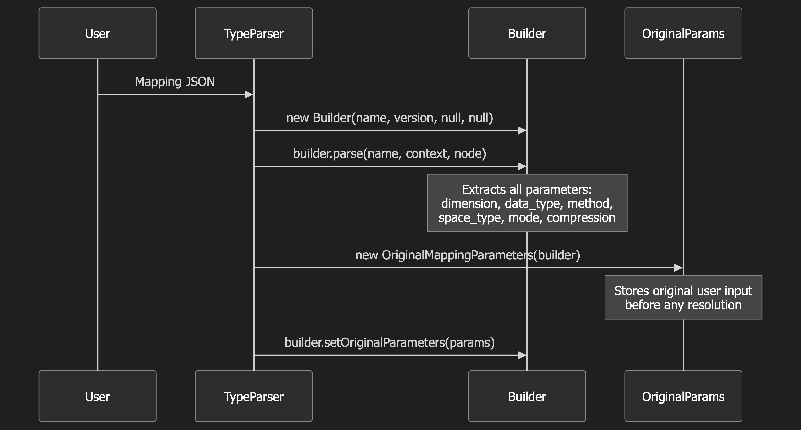

## 1. User Creates Index - knn enable 

Define index structure and enable derived source optimization for vector storage, this enables us for the following topics

**Input**

```
PUT /my-index
{
  "settings": {
    "index.knn": true,
    "index.knn.derived_source.enabled": true
  },
  "mappings": {
    "properties": {
      "embedding": {
        "type": "knn_vector",
        "dimension": 128,
        "method": {
          "name": "disk_ann",
          "engine": "jvector",
          "space_type": "l2"
        }
      }
    }
  }
}
```

## 2. Mapping Parser Invocation

Route mapping JSON through OpenSearch's type system to appropriate field mapper

**Call Stack**
```
RestCreateIndexAction
  → MetadataCreateIndexService.applyCreateIndexRequest()
    → MapperService.merge()
      → DocumentMapper.parse()
        → RootObjectMapper.parse()
          → KNNVectorFieldMapper.TypeParser.parse()
```


**Outcome**: Control reaches k-NN plugin's custom type parser

## 3. KNNVectorFieldMapper.TypeParser.parse()

Parse user-provided mapping into internal configuration objects

- Extracts dimension: 128 → stores in builder.dimension
- Extracts method.name: "disk_ann" → stores in builder.knnMethodContext
- Extracts method.engine: "jvector" → stores in method context
- Extracts method.space_type: "l2" → stores in method context
- Sets defaults for unspecified parameters

**Outcome**: Builder object populated with:

```java
Builder {
    name: "embedding",
    dimension: Parameter<Integer>(128),
    vectorDataType: Parameter<VectorDataType>(FLOAT),  // default
    knnMethodContext: Parameter<KNNMethodContext> {
        methodComponentContext: {
            name: "disk_ann",
            parameters: {}
        },
        knnEngine: JVECTOR,
        spaceType: L2
    }
}

```

**Implementation** 

```java
Builder builder = new Builder(
    "embedding",                          // field name
    parserContext.indexVersionCreated(),  // Version.V_3_0_0
    null,                                 // modelId (null for non-model)
    null                                  // originalParameters (set later)
);

builder.parse("embedding", parserContext, node);
```

## 4. Store Original Parameters

Preserve user's original configuration before resolution/defaults applied

- User might specify partial config (e.g., no M parameter)
- System will fill defaults during resolution
- Need to distinguish user-provided vs system-provided values
- Important for validation and error messages

**Outcome**: OriginalMappingParameters object stores snapshot of user's exact input




## 5. Resolve Engine & Method Context

***Purpose:** Fill in missing parameters with intelligent defaults based on engine, version, and data type

**Implementation**

```java
resolveKNNMethodComponents();
```

### 5.1 Create Method Config Context

Create context object that guides parameter resolution

**Outcome**: Context object used by engine to determine appropriate defaults

**Implementation**

```java
builder.setKnnMethodConfigContext(
    KNNMethodConfigContext.builder()
        .vectorDataType(VectorDataType.FLOAT)
        .versionCreated(Version.V_3_0_0)
        .dimension(128)
        .mode(Mode.NOT_CONFIGURED)
        .compressionLevel(CompressionLevel.NOT_CONFIGURED)
        .build()
);
```

### 5.2 Resolve Engine

Determine which engine (NMSLIB, LUCENE, JVECTOR, FAISS) handles this field

**Resolution Logic:**

- If user specified engine → use it
- If method is "disk_ann" → must be JVECTOR
- If method is "hnsw" and version >= 2.18 → LUCENE
- Otherwise → use index-level default

**Implementation:**

```java
KNNEngine resolvedKNNEngine = EngineResolver.INSTANCE.resolveEngine(
    builder.knnMethodConfigContext,
    builder.originalParameters.getResolvedKnnMethodContext(),
    false  // requiresTraining
);
// Returns: KNNEngine.JVECTOR

setEngine(builder.originalParameters.getResolvedKnnMethodContext(), KNNEngine.JVECTOR);
```

### 5.3 Resolve Method Parameters

**Purpose**: Fill in all missing method parameters with engine-specific defaults

**Outcome**: Fully resolved method context

**Implementation**

```java
ResolvedMethodContext resolvedMethodContext = KNNEngine.JVECTOR.resolveMethod(
    builder.originalParameters.getResolvedKnnMethodContext(),
    builder.knnMethodConfigContext,
    false,  // requiresTraining
    SpaceType.L2
);
```

## 6.Build Field Mapper

Instantiate the actual mapper object that will handle document parsing

**Implementation**

```java
if (knnEngine == KNNEngine.LUCENE || knnEngine == KNNEngine.JVECTOR) {
    // operations
    return LuceneFieldMapper.createFieldMapper(...);
}
```

### 6.1.Why LuceneFieldMapper for JVector?

- JVector uses Lucene's native vector format
- Shares same codec infrastructure as Lucene
- Only difference is graph building algorithm

### 7.LucineFieldMapper

Initialize all components needed for document parsing and validation

```java
new LuceneFieldMapper()
```

### 7.1.Get Similarity Function

Map k-NN space type to Lucene's similarity function enum

**Mapping**:
- L2 → EUCLIDEAN
- COSINE → COSINE
- INNER_PRODUCT → DOT_PRODUCT

**Outcome**: Lucene-compatible similarity function

### 7.2.Create Vector FieldType

Create Lucene FieldType for KnnFloatVectorField

**Implementation**

```java
this.fieldType = VectorDataType.FLOAT.createKnnVectorFieldType(
    128,
    knnVectorSimilarityFunction
);
```

**Outcome**

```java
KnnFloatVectorField.FieldType {
    vectorDimension: 128,
    vectorSimilarityFunction: EUCLIDEAN,
    vectorEncoding: FLOAT32,
    stored: false, // vectors stored separately in vector index
    omitNorms: true, // norms not needed for vectors
    indexOptions: NONE, // not a text field
    docValuesType: NONE // doc values handled separetely
}
```

### 8. Complete Outcome

```
IndexMetadata {
    mappings: {
        "embedding": LuceneFieldMapper {
            name: "embedding",
            fieldType: KnnFloatVectorField.FieldType(dim=128, sim=EUCLIDEAN),
            vectorFieldType: FieldType(docValues=BINARY),
            perDimensionProcessor: IdentityProcessor,
            perDimensionValidator: FiniteValueValidator,
            vectorValidator: DimensionValidator(128),
            knnMethodContext: {
                engine: JVECTOR,
                method: "disk_ann",
                parameters: {m: 16, ef_construction: 100, alpha: 1.2},
                spaceType: L2
            }
        }
    },
    settings: {
        "index.knn": true,
        "index.knn.derived_source.enabled": true
    }
}
```