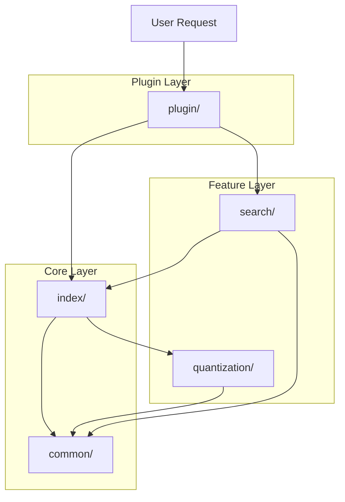

# KNN Core Structure

## Overview Structure
```
org.opensearch.knn/
├── common/          # Shared utilities and constants
├── index/           # Core indexing functionality (already explained)
├── plugin/          # Plugin entry point and configuration
├── quantization/    # Vector compression algorithms
└── search/          # Search-time features and processors
```

---

## 1. **`common/`** - Shared Utilities & Constants

**Purpose**: Centralized location for shared code used across the entire plugin

**Key Components**:

### **KNNConstants.java**
Defines all constant values used throughout the plugin:
- **Field names**: "dimension", "engine", "method", "space_type"
- **Method names**: "hnsw", "disk_ann"
- **Parameter names**: "ef_search", "ef_construction", "m", "nprobes"
- **Engine names**: "lucene", "jvector"
- **MMR constants**: "diversity", "candidates"
- **Default values**: overquery_factor=5, alpha, neighbor_overflow

**Why it exists**: Prevents magic strings scattered throughout code, ensures consistency

### **KNNValidationUtil.java**
Validation functions for:
- Vector dimensions
- Parameter ranges
- Configuration validity
- Data type compatibility

### **KNNVectorUtil.java**
Utility functions for vector operations:
- Vector normalization
- Distance calculations
- Vector conversions (float to byte, etc.)

### **exception/**
Custom exception types:
- `DeleteModelException`: When model deletion fails
- `KNNInvalidIndicesException`: Invalid index operations
- `OutOfNativeMemoryException`: Memory exhaustion

### **featureflags/**
Feature flag management for gradual rollout of new features

**Example Usage**:
```
Instead of: if (method.equals("hnsw"))
Use:        if (method.equals(KNNConstants.METHOD_HNSW))

Benefits: Typo-proof, refactoring-friendly, IDE autocomplete
```

---

## 2. **`plugin/`** - Plugin Entry Point

**Purpose**: Integrates the KNN functionality into OpenSearch as a plugin

**Key Components**:

### **JVectorKNNPlugin.java**
Main plugin class that:
- Registers the `knn_vector` field type with OpenSearch
- Registers the `knn` query type
- Provides custom codec for vector storage
- Registers REST API handlers
- Configures script engines for custom scoring
- Sets up search pipeline processors

**What it does**:
```
OpenSearch Startup
    ↓
Load JVectorKNNPlugin
    ↓
Register Components:
  - Field Mapper (knn_vector type)
  - Query Builder (knn query)
  - Codec Service (vector storage)
  - REST Handlers (/_plugins/_knn/*)
  - Script Engine (knn_score)
  - Search Processors (MMR)
    ↓
Plugin Ready
```

### **rest/**
REST API handlers for:
- `/_plugins/_knn/stats`: Get plugin statistics
- Model management endpoints
- Warmup endpoints

### **script/**
Custom scripting support:
- `knn_score`: Calculate similarity scores in scripts
- Custom scoring functions for advanced use cases

### **stats/**
Statistics collection and reporting:
- Query counts
- Cache hit rates
- Memory usage
- Performance metrics

### **transport/**
Internal communication between cluster nodes:
- Stats transport actions
- Model distribution
- Cluster coordination

**Why it exists**: Provides the bridge between OpenSearch core and KNN functionality

---

## 3. **`quantization/`** - Vector Compression

**Purpose**: Implements various vector compression algorithms to reduce memory usage

**Key Components**:

### **quantizer/**
Actual quantization implementations:
- **OneBitScalarQuantizer**: 1 bit per dimension (32x compression)
- **MultiBitScalarQuantizer**: 2-8 bits per dimension (4-16x compression)
- **BitPacker**: Efficiently packs bits into bytes
- **QuantizerHelper**: Shared quantization utilities

### **models/**
Data structures for quantization:
- **quantizationState/**: Stores learned quantization parameters
  - `OneBitScalarQuantizationState`: Mean thresholds
  - `MultiBitScalarQuantizationState`: Min/max ranges
  - `QuantizationStateCache`: Caches quantization states
- **quantizationOutput/**: Stores quantized vectors
- **quantizationParams/**: Configuration parameters
- **requests/**: Training request structures

### **factory/**
Factory pattern for creating quantizers:
- `QuantizerFactory`: Creates appropriate quantizer based on config
- `QuantizerRegistry`: Registers available quantizers
- `QuantizerRegistrar`: Plugin registration mechanism

### **enums/**
Enumeration types:
- `ScalarQuantizationType`: ONE_BIT, TWO_BIT, FOUR_BIT

### **sampler/**
Sampling strategies for training:
- `ReservoirSampler`: Randomly samples vectors for training
- `SamplerType`: Different sampling algorithms
- `SamplingFactory`: Creates samplers

**How it works**:
```
Training Phase:
  Sample 25,000 vectors → Calculate statistics → Store quantization state

Indexing Phase:
  Original vector → Quantize using state → Store compressed vector

Search Phase:
  Query vector → Quantize → Search compressed index → Rerank with originals
```

**Why it exists**: Enables storing billions of vectors in limited memory

---

## 4. **`search/`** - Search-Time Features

**Purpose**: Implements advanced search features and result processing

**Key Components**:

### **extension/**
Search extensions that modify search behavior:

**MMRSearchExtBuilder.java** - Maximal Marginal Relevance
- **What it does**: Diversifies search results to avoid redundancy
- **Parameters**:
  - `diversity` (0-1): Weight between relevance and diversity
  - `candidates`: How many results to oversample for reranking
  - `vector_field_path`: Which vector field to use
  - `vector_field_data_type`: Type of vectors (float, byte, binary)
  - `space_type`: Distance metric (L2, cosine, inner product)

**Example Use Case**:
```
Problem: User searches "python programming"
Without MMR: Returns 10 very similar Python tutorial articles
With MMR: Returns diverse results:
  - Python tutorial
  - Python web frameworks
  - Python data science
  - Python vs other languages
  - Python best practices
```

### **processor/**
Search pipeline processors that transform queries and results:

**mmr/** - MMR Implementation
- **MMROverSampleProcessor**: Increases k to get more candidates
- **MMRRerankProcessor**: Reranks results for diversity
- **MMRKnnQueryTransformer**: Transforms KNN queries for MMR
- **MMRUtil**: Utility functions for MMR operations
- **MMRVectorFieldInfo**: Metadata about vector fields

**How MMR Works**:
```
1. Original Query: k=10
   ↓
2. Oversample: Fetch k×candidates (e.g., 10×5 = 50 results)
   ↓
3. Rerank: Select 10 most diverse results
   ↓
4. Return: 10 diverse results to user
```

**MMR Algorithm**:
```
Selected = []
Candidates = [50 results]

For i = 1 to 10:
  For each candidate:
    relevance_score = similarity(candidate, query)
    diversity_score = min_similarity(candidate, Selected)
    mmr_score = λ × relevance_score - (1-λ) × diversity_score
  
  Select candidate with highest mmr_score
  Add to Selected
  Remove from Candidates
```

**Why it exists**: Improves search quality by balancing relevance and diversity

---

## 5. **Folder Interaction Diagram**



---

## 6. **Real-World Example: Complete Flow**

### **Indexing a Document**:
```
1. User sends document with vector
   ↓
2. plugin/ receives request
   ↓
3. index/mapper/ parses vector field
   ↓
4. common/ validates dimensions
   ↓
5. quantization/ compresses vector (if enabled)
   ↓
6. index/codec/ stores to disk
```

### **Searching with MMR**:
```
1. User sends search with MMR extension
   ↓
2. plugin/ routes to search pipeline
   ↓
3. search/processor/ transforms query (oversample)
   ↓
4. index/query/ executes vector search
   ↓
5. search/processor/ reranks for diversity
   ↓
6. Return diverse results
```

---

## Summary Table

| Folder | Purpose | Key Responsibility |
|--------|---------|-------------------|
| **common/** | Shared utilities | Constants, validation, exceptions |
| **plugin/** | OpenSearch integration | Plugin registration, REST APIs |
| **index/** | Core indexing | Mappers, codecs, engines, queries |
| **quantization/** | Compression | Vector quantization algorithms |
| **search/** | Search features | MMR, result processing |

Each folder has a clear, focused responsibility that contributes to the overall vector search functionality while maintaining clean separation of concerns.